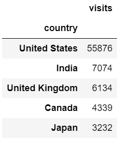
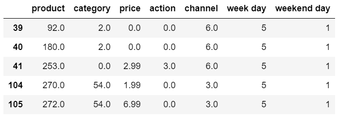
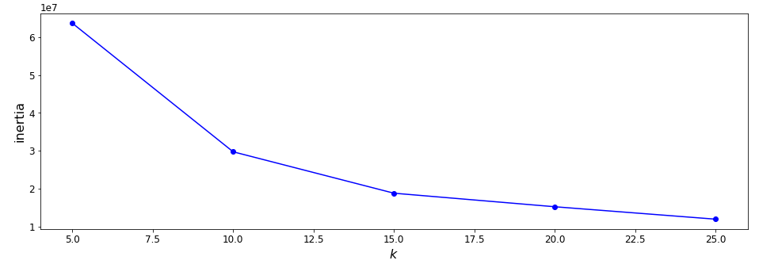
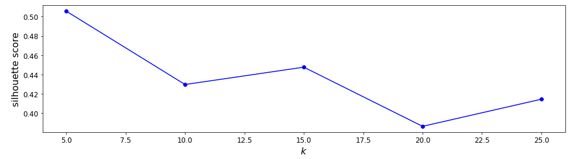
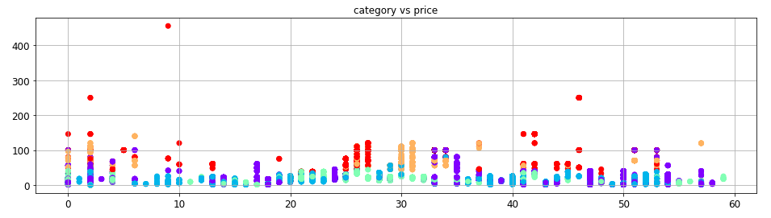

# ClientSculpt: Mastering Customer Segmentation

- [Context](#context)
- [Introduction](#introduction)
   + [Data exploring](big_query.ipynb)
- [Clustering](#clustering)
   + [Clustering](big_query.ipynb)
- [Insights](#insights)
   + [Insights](big_query.ipynb)

# Context

Utilizing *Google's BigQuery* as a Robust Data Source, this notebook delves into the dynamic consumer behavior within the United States. 

By scrutinizing distinct days, it endeavors to extract valuable insights, leading to a comprehensive customer segmentation. The ultimate goal is to refine our **pricing strategy** through a profound understanding of their behaviors.

# Introduction

After conducting an extensive analysis of countries by visitor count, it is evident that the United States stands out as the leading contender. 

To delve into the intricacies of refining pricing strategies, our focus narrows down exclusively to the United States. Within this scope, we meticulously cherry-pick relevant attributes such as quantity, **price, revenue**, action channel, and more, strategically aligning with our specific goal. While additional variables exist within the dataset, our current investigation intentionally centers around these chosen aspects.

To facilitate our analysis, we introduce the incorporation of day numbers along with the inclusion of a weekend flag, effectively identifying Fridays and Saturdays. 

It's important to note that as part of the data preprocessing, we'll undertake a **price** adjustment by dividing the price by 1e6 to ensure optimal accuracy and scale.

It's vital to acknowledge that certain features, such as products, category, and channel, required encoding for further analysis.

# Clustering

Our starting point for this clustering analysis will be K-means, particularly utilizing the K-means++ initialization method. However, it's worth noting that we do have some outliers in our data, and the complexity of the clustering is not yet fully known.

As depicted in the following visualization, the inertia diminishes as we incorporate more clusters. This decrease is expected since a greater number of clusters naturally results in shorter distances to their centroids. However, it's crucial to emphasize that the essence of clustering is not to achieve a one-to-one correspondence between clusters and data points. Rather, the objective is to uncover shared behaviors among clients. Hence, while inertia serves as a helpful guideline, it doesn't strictly dictate our clustering approach.

A more effective method involves employing the **silhouette score** to establish appropriate cluster assignments. As illustrated on the screen, the score demonstrates a decline as the number of clusters increases. Therefore, by analyzing the chart, we can infer that proceeding with 5 clusters would be a judicious choice to glean further insights.

_Note: It's crucial to emphasize that our initial analytical approach involves utilizing the **k-means** algorithm. However, considering the unique nature of our data, the presence of outliers, and the uncertain complexity of the clusters, an alternative avenue we're considering is the **DBSCAN** method. We acknowledge that while distance to the centroid seems reasonable, there's a possibility that the optimal approach may be more aligned with spectral density._

# Insights

After successfully categorizing our customers, we can delve deeper into the insights derived from these clusters, aligning with our initial assumptions. We've identified five distinct customer segments.

The chart below vividly illustrates that the red and orange clients show a stronger inclination towards purchasing items from higher-priced categories. However, in contrast, the purple clients exhibit a preference for lower-priced categories, albeit with a higher frequency across multiple categories. This discerns them as our price-conscious seekers. Meanwhile, the red and orange clients represent our higher-value customers, more inclined towards premium pricing.

